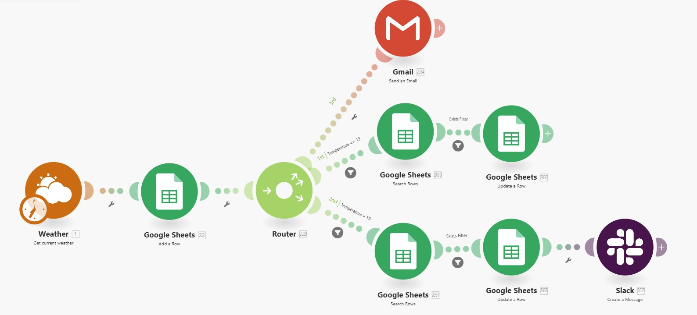

# Weather Record System Automation with Make.com

---

This Make.com automation scenario records the current weather, logs it to Google Sheets, and takes further action based on the temperature—such as sending emails, updating records, and sending Slack messages.

 

**Organization:** Majestik Magik 

**Author:** Amos0312  

**Email:** amosmiller0312@gmail.com  

  

---

## 🔧 Tools Used

- [Make.com](https://www.make.com)
- OpenWeatherMap API (or any weather API)
- Google Sheets
- Gmail
- Slack

## 📌 Workflow Overview

1. **Get Current Weather**  
   The scenario starts by calling a weather API (e.g., OpenWeatherMap) to get the latest temperature and weather data for a specific location.

2. **Add Data to Google Sheets**  
   The weather data is added as a new row in a Google Sheet for logging and tracking.

3. **Router for Conditional Actions**  
   The router checks the temperature value and branches into three possible paths:

   - **Route 1**:  
     If temperature is retrieved (regardless of value), send an email via **Gmail** notifying the user of the latest weather update.

   - **Route 2**:  
     If the **temperature is less than or equal to 19°C**, search existing rows in Google Sheets with that condition and update them with a tag like `"Cold Day"`.

   - **Route 3**:  
     If the **temperature is above 19°C**, update the relevant rows in Google Sheets with a tag like `"Warm Day"` and send a message in a **Slack** channel (e.g., `#weather-updates`).

## 📄 Example Google Sheets Columns

| Date & Time       | Temperature (°C) | Weather      | Tag       |
|-------------------|------------------|--------------|-----------|
| 2025-06-08 08:00  | 17               | Cloudy       | Cold Day  |
| 2025-06-08 12:00  | 23               | Sunny        | Warm Day  |

## 📧 Example Email Content

> Subject: 🌦️ New Weather Update  
> Body: The current temperature is 17°C with cloudy conditions. Logged to your weather record system.

## 💬 Example Slack Message

> 🔔 New warm weather logged: 23°C and sunny in Los Angeles.  
> Logged and updated in Google Sheets.

## ✅ Setup Instructions

1. **Create a Google Sheet** with columns: Date & Time, Temperature, Weather, Tag.
2. **Get an API key** from your weather provider (e.g., OpenWeatherMap).
3. **Create a scenario in Make.com** and configure the modules in the following order:
   - HTTP module (to fetch weather data)
   - Google Sheets: Add a Row
   - Router
     - Gmail: Send Email
     - Google Sheets: Search & Update rows if temp ≤ 19
     - Google Sheets: Search & Update rows if temp > 19 + Slack: Send Message
4. **Schedule the scenario** to run automatically (e.g., every hour).

## 📆 Use Cases

- Daily or hourly weather monitoring
- Logging climate trends
- Alerts for temperature thresholds (for farming, construction, etc.)
- Slack notifications for team awareness

---
